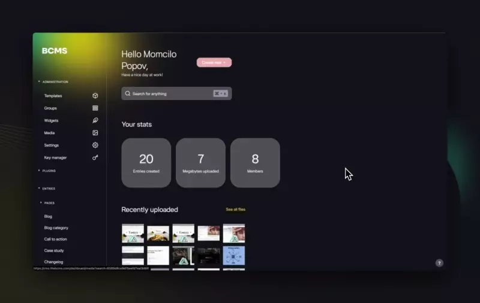

<div align="center">
    
</div>

<h2 align="center">
  BCMS - Open-source Headless CMS
</h1>
<p align="center">
  BCMS is an open-source, self-hostable Headless CMS. Built with Node.js, MongoDB, Vue 3, and Tailwind. <br>
  Design your content structure without leaving the browser. <br> Consume content via APIs. Works nicely with Next.js, Nuxt.js & Gatsby.js.<br>
</p>
<p align="center">🌐 <a href="https://thebcms.com">Website</a> · 📚 <a href="https://docs.thebcms.com">Documentation</a> · 💻 <a href="https://cloud.thebcms.com/">Demo</a> · 💬 <a href="https://discord.gg/Rr4kTKpU">Discord</a> · 🤓 <a href="https://github.com/bcms/starters">Code starters</a><p>
<br />
<!--
[![NPM Version][npm-image-ui]][npm-url-ui]
[![NPM Version][npm-image-sdk]][npm-url-sdk]
[![NPM Version][npm-image-backend]][npm-url-backend]
[![NPM Version][npm-image-client]][npm-url-client]
[![NPM Version][npm-image-cli]][npm-url-cli]
[![NPM Version][npm-image-most]][npm-url-most]
[](https://twitter.com/thebcms)
[](https://www.thebcms.com) -->
<br>

## ⚙️ Quickstart
To install BCMS on your computer run:
```
npm install @becomes/cms-cli -g
```
and then
```
bcms --cms create
```

To self-host BCMS on DigitalOcean, please refer to the [Self-hosting](https://docs.thebcms.com/install/digitalocean).<br />
To get started with BCMS Cloud, please refer to the [BCMS Cloud](https://cloud.thebcms.com/).
<br><br><br><br>
<h2 align="center">
  Features only BCMS have  🦄
</h2>
<p align="center">
  Advanced stuff, nicely put together for smooth use.
</p>

<table align="center">
  <tbody>
    <tr>
      <td>
        <strong>🏋️&zwj;♀️ Your custom Functions</strong> <br />
        Deploy and host custom, native serverless-ish functions that you can
        trigger from anywhere. <br />Great for handling form submissions, for
        example.<br />
        <a
          href="https://docs.thebcms.com/customization/functions"
          rel="nofollow"
          >Functions docs</a
        >
      </td>
    </tr>
    <tr>
      <td>
        <strong>⏱️ Cron jobs</strong><br />
        Schedule tasks right in BCMS. <br />
        <a href="https://docs.thebcms.com/customization/jobs" rel="nofollow"
          >Cron jobs docs</a
        >
      </td>
    </tr>
    <tr>
      <td>
        <strong>🧱 NGINX Configuration</strong><br />
        You don't need to be a DevOps genius; BCMS has got your back.<br />
        <a href="https://docs.thebcms.com/cloud/nginx" rel="nofollow"
          >NGINX docs</a
        >
      </td>
    </tr>
    <tr>
      <td>
        <strong>🔏 Granular permissions, by default</strong> <br />
        Enterprise-level granular permissions - available for everyone.
      </td>
    </tr>
    <tr>
      <td>
        <strong>⭐️ Custom pages inside BCMS</strong> <br />
        Develop custom pages that have access to all your data from BCMS.
        <br />Great when you want to display carts, custom reporting, or extend
        BCMS functionality in any way.<br />
        <a href="https://docs.thebcms.com/customization/plugins" rel="nofollow"
          >Plugins docs</a
        >
      </td>
    </tr>
    <tr>
      <td>
        <strong>⌨️ A mind-blowing TypeScript support</strong> <br />
        Everything in BCMS is typed. <br />Even the dynamic content you create,
        BCMS automatically generates types for it. <br />
        <a href="https://github.com/bcms/cms/tree/master/backend/src/types"
          >TypeScript files</a
        >
      </td>
    </tr>
    <tr>
      <td>
        <strong>🌷 Beautifuuul code starters</strong> <br />
        Well-designed code starters for Next.js, Nuxt.js, and Gatsby.js<br />
        <a href="https://github.com/bcms/starters/"
          > BCMS starters</a
        >
      </td>
    </tr>
    <tr>
      <td>
        <strong>🔑 API keys with fine-grained permissions</strong> <br />
        API keys come with out-of-the-box, built-in, fine-grained access permissions.<br />
        <a href="https://docs.thebcms.com/inside-bcms/key-manager"
          > Key manager docs</a
        >
      </td>
    </tr>
    <tr>
      <td>
        <strong>🏰 Each project is deployed in its own dedicated server</strong> <br />
        When you are using BCMS Cloud, each BCMS instance is deployed on a dedicated server.<br />
        <a href="https://docs.thebcms.com/cloud"
          > Cloud docs</a
        >
      </td>
    </tr>
  </tbody>
</table>
<br>
<h2 align="center">
  A cut above: Features BCMS shares with just a few 🎩
</h2>
<p align="center">TBH, even when one of these features is available in another tool, sometimes it's a headache. <br>We make it smooth.</p>


<table align="center">
  <tbody>
    <tr>
      <td>
        <strong>🏡 Self-hosted CMS</strong> <br />
        Self-host BCMS. The freedom to host your content wherever you want. Your data, your rules. <br />
        <a href="https://docs.thebcms.com/install/digitalocean" rel="nofollow"
          >Self hosting docs</a
        >
      </td>
    </tr>
    <tr>
      <td>
        <strong>🤞 Widgets in content</strong><br />
        Ability to add structured content anywhere in the content. <br />In
        between two paragraphs? No problem. Great for image galleries in a blog
        post, embeds, etc. <br />
        <a href="https://docs.thebcms.com/inside-bcms/widgets" rel="nofollow"
          >Widgets docs</a
        >
      </td>
    </tr>
    <tr>
      <td>
        <strong>📁 Foldersssss</strong><br />
        Sounds funny, but not many CMSs out there support folders. Let
        alone folders inside folders 🤯.<br />
        <a href="https://docs.thebcms.com/inside-bcms/media" rel="nofollow"
          >Media docs</a
        >
      </td>
    </tr>
    <tr>
      <td>
        <strong>🛜 A truly browser-based CMS</strong> <br />
        Design content structure without leaving the browser. No need to learn
        complex syntax, and code<br /> interface on your own.<br />
        <a href="https://docs.thebcms.com/inside-bcms/templates" rel="nofollow"
          >Templates docs</a
        >
      </td>
    </tr>
    <tr>
      <td>
        <strong>🫂 Collaborative</strong> <br />
        Multiple team members can edit the same entry simultaneously<br />
        <a href="https://docs.thebcms.com/inside-bcms/settings#invite-team-members" rel="nofollow"
          >Team docs</a
        >
      </td>
    </tr>
    <tr>
      <td>
        <strong>👩‍💻 Next.js CMS integration</strong> <br />
        Out-of-the-box integration with Next.js<br />
        <a href="https://docs.thebcms.com/integrations/next-js" rel="nofollow"
          >Next.js docs</a
        >
      </td>
    </tr>
    <tr>
      <td>
        <strong>👨‍💻 Gatsby.js CMS integration</strong> <br />
        Out-of-the-box integration with Gatsby.js<br />
        <a href="https://docs.thebcms.com/integrations/gatsby-js" rel="nofollow"
          >Gatsby.js docs</a
        >
      </td>
    </tr>
    <tr>
      <td>
        <strong>🧑‍💻 Nuxt.js CMS integration</strong> <br />
        Out-of-the-box integration with Nuxt.js<br />
        <a href="https://docs.thebcms.com/integrations/nuxt-js" rel="nofollow"
          >Nuxt.js docs</a
        >
      </td>
    </tr>
    <tr>
      <td>
        <strong>🏴‍☠️ Multilingual CMS</strong> <br />
        Add content in any number of languages. No restrictions.<br />
        <a href="https://docs.thebcms.com/inside-bcms/settings#adding-languages" rel="nofollow"
          >Languages docs</a
        >
      </td>
    </tr>
  </tbody>
</table>

<br><br>

<h2 align="center">
  The essentials: Features BCMS has in common with most CMSs  🛠️
</h2>
<p align="center">Don't worry, we didn't skip the basics. Here's what BCMS offers that you'd expect <br> from any self-respecting headless CMS</p>

<table align="center">
  <tbody>
    <tr>
      <td>
        <strong>🏡 Input types</strong> <br />
        10+ input types. Built-in. But you don't need to learn any specific syntax,<br>
        just select them from the interface. <br /><a
          href="https://docs.thebcms.com/inside-bcms/properties"
          rel="nofollow"
          >Properties docs</a
        >
      </td>
    </tr>
    <tr>
      <td>
        <strong>🎬 Media manager</strong><br />
        Upload any and all kinds of files. If it's digital, BCMS can handle it. <br>
        <a href="https://docs.thebcms.com/inside-bcms/media" rel="nofollow"
          >Media docs</a
        >
      </td>
    </tr>
    <tr>
      <td>
        <strong>👫 Team collaboration</strong><br />
        Invite other team members, give them permissions, and work simultaneously 
        across the entire BCMS. <br />
        <a
          href="https://docs.thebcms.com/inside-bcms/settings#invite-team-members"
          rel="nofollow"
          >Team docs</a
        >
      </td>
    </tr>
    <tr>
      <td>
        <strong>🚩 🏳️ Statuses for entries</strong> <br />
        Drafts, production, and everything in between. Keep your content <br />
        lifecycle as organized as whatever in the world is organized these days.<br />
        <a
          href="https://docs.thebcms.com/inside-bcms/entries#setting-the-entry-status"
          rel="nofollow"
          >Statuses docs</a
        >
      </td>
    </tr>
    <tr>
      <td>
        <strong>😘 Friendly support</strong> <br />
        We are a small team of strong believers in this kind of technology. <br />
        Have a question? Don't hesitate to reach out. <br />
        <a href="https://thebcms.com/contact" rel="nofollow">Contact us</a>
      </td>
    </tr>
    <tr>
      <td>
        <strong>🚿 Ever-growing docs and tutorials base</strong> <br />
        We love writing about BCMS. <br /><a
          href="https://docs.thebcms.com"
          rel="nofollow"
          >BCMS docs</a
        >
      </td>
    </tr>
  </tbody>
</table>
<br><br>

<h2 align="center">Contributing</h2>
<p align="center">
  We ❤️ contributions big and small.
</p>
<p align="center">
  Open a PR (see our instructions on <a href="https://docs.thebcms.com/install/locally">developing BCMS locally</a>)<br>
  Submit a <a href="https://github.com/bcms/cms/issues/new?assignees=&labels=enhancement%2C+feature&template=feature_request.md">feature request</a> or <a href="https://github.com/bcms/cms/issues/new?assignees=&labels=bug&template=bug_report.md">bug report</a><br>
</p>
<br><br>
<h2 align="center">Support ❤️</h2>
<p align="center">
  If you like the project, hit the ⭐ button
</p>
<br><br>
<h2 align="center">Code starters 📦</h2>
<p align="center">
  Free, beautiful, customizable, responsive, high-performance starters integrated with BCMS. <br />
  Built with Tailwind CSS and your favorite framework. Ready-to-use. <br /><br />
  <a href="https://github.com/bcms/starters?tab=readme-ov-file#gatsby-starters"></a>
  <a href="https://github.com/bcms/starters?tab=readme-ov-file#nuxt-starters"></a>
  <a href="https://github.com/bcms/starters?tab=readme-ov-file#nextjs-starters"></a>
  <a href="https://github.com/bcms/starters?tab=readme-ov-file#sveltekit-starters"></a>
  <a href="https://github.com/bcms/starters?tab=readme-ov-file#astrojs-starters"></a>
</p>
<div align="center">
  <a href="https://github.com/bcms/starters">
    See all BCMS starters
  </a>
</div>
<div align="center">
  <a href="https://github.com/bcms/starters">
    
  </a>
</div>
<br><br>
<h2 align="center">Stay in touch 🌐</h2>
<p align="center">
  <a href="https://twitter.com/thebcms">Follow on X (Twitter)</a><br>
  <a href="https://www.linkedin.com/company/thebcms/">Follow on LinkedIn</a><br>
  <a href="https://discord.gg/Rr4kTKpU">Join us on Discord</a><br>
</p>
<br>
<h2 align="center">License 📄</h2>
<p align="center">
  <a href="https://github.com/bcms/cms/blob/master/LICENSE">MIT</a><br>
</p>
